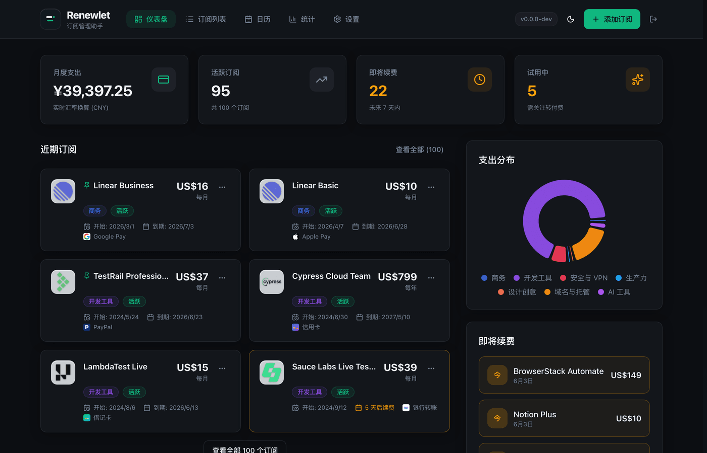
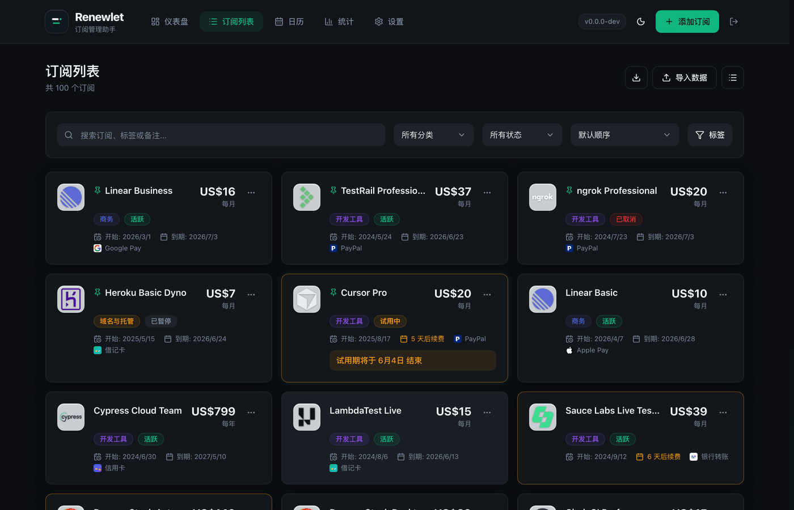
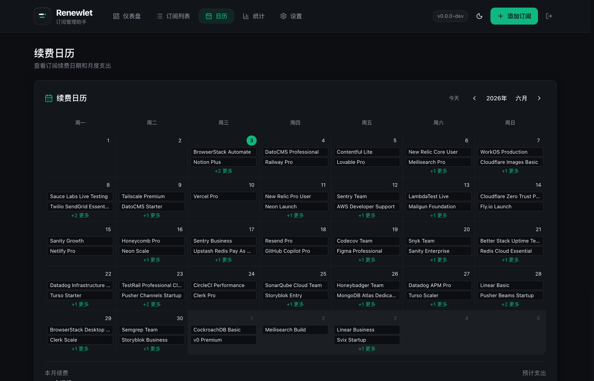
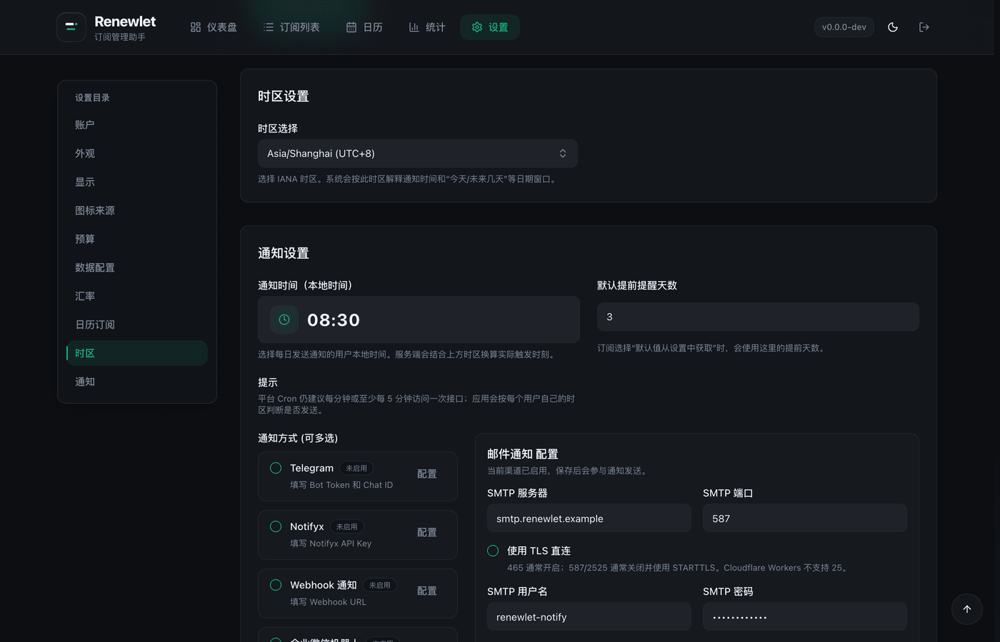

# Renewlet

[简体中文](README.md) | [English](README.en.md)

Renewlet 是给开发者、独立团队和家庭实验室准备的自托管订阅控制台：把 AI 工具、云服务、开发工具和协作 SaaS 的续费、支出、预算与通知放在一个清爽的地方。

<p align="center">
  
  
  
  
  
</p>

<p align="center">
  
</p>

<p align="center">
  <sub>截图使用 20 条面向开发者的真实服务公开定价演示数据（价格快照：2026-05-17），实际价格可能随官方页面、地区、税费和计费周期调整。</sub>
</p>

<p align="center"><strong>订阅网格</strong></p>

<p align="center">
  
</p>

<p align="center"><strong>统计分析</strong></p>

<p align="center">
  
</p>

<p align="center"><strong>续费日历</strong></p>

<p align="center">
  
</p>

<p align="center"><strong>通知方式</strong></p>

<p align="center">
  
</p>

## 项目简介

Renewlet 帮你集中管理各类订阅服务：记录价格、币种、扣费周期、续费日期、付款方式、标签和备注，并通过仪表盘、续费日历和统计视图了解每月订阅支出。它把 React 前端和 Go/PocketBase 后端打包到一个 Docker 镜像中，适合部署在自己的服务器、NAS 或家庭实验环境里。

当前架构：

- `packages/server`：Go + PocketBase 嵌入式后端，负责 SQLite、认证、文件、后台管理、数据模型和自定义业务 API。
- `packages/client`：Vite + React SPA，使用 PocketBase JS SDK、本地路由、主题和国际化文案。
- Docker 镜像：最终运行一个 Go binary，同时提供 PocketBase API、业务 API、PocketBase Admin、静态资源和 SPA fallback。

## 功能特性

- 订阅管理：记录订阅名称、Logo、价格、币种、扣费周期、状态、分类、付款方式、网站、标签和备注。
- 续费提醒：按用户本地时区和提醒天数生成通知，支持通知历史和失败重试。
- 多渠道通知：支持 Telegram、Notifyx、Webhook、企业微信机器人、SMTP 邮件和 Bark。
- 统计分析：按月折算订阅成本，展示预算使用、分类拆分、付款方式拆分和停用订阅节省。
- 多币种显示：可选择 Frankfurter 或 FloatRates 汇率来源，远端失败时自动兜底，最终使用内置备用汇率保证可用。
- 自托管部署：单容器运行，SQLite 数据可通过本地目录或 Docker volume 持久化。
- 中英双语界面：应用内支持简体中文和 English。

## Docker 一键部署

推荐使用 Docker Hub 预构建镜像，脚本会自动下载部署模板、生成随机密钥、创建本地数据目录，不需要手动编辑 `.env` 或 `docker-compose.yml`。

准备一台已安装 Docker 和 Docker Compose v2 的服务器，执行：

```bash
mkdir -p renewlet && cd renewlet
curl -fsSL https://raw.githubusercontent.com/zhiyingzzhou/renewlet/main/deploy/docker-deploy.sh | bash
docker compose up -d
```

首次启动后访问：

```text
http://localhost:3000/setup
```

创建第一个管理员用户。如果 PocketBase 还没有 superuser，该账号也会成为 PocketBase Admin UI 的初始账号；如果已经存在 superuser，则不会覆盖既有后台账号。

脚本会生成这些文件：

| 路径 | 说明 |
| --- | --- |
| `docker-compose.yml` | 使用 `zhiyingzzhou/renewlet:latest` 的生产部署模板。 |
| `.env` | 端口、镜像、时区、密钥和通知调度配置；`PB_ENCRYPTION_KEY` 与 `CRON_SECRET` 会自动生成。 |
| `data/` | 持久化数据目录，挂载到容器内 `/pb_data`。 |

如果 Docker Hub 拉取不可用，可以把 `.env` 中的镜像改为 GHCR：

```env
RENEWLET_IMAGE="ghcr.io/zhiyingzzhou/renewlet:latest"
```

然后重新拉取并启动：

```bash
docker compose pull
docker compose up -d
```

## 常用运维

查看状态和日志：

```bash
docker compose ps
docker compose logs -f
```

升级前建议先备份数据和配置：

```bash
tar -czf renewlet-backup-$(date +%F).tgz .env docker-compose.yml data
```

升级到最新镜像：

```bash
docker compose pull
docker compose up -d
docker compose logs -f
```

重启服务：

```bash
docker compose restart
```

迁移到新机器时，在新机器解压备份后启动：

```bash
mkdir -p renewlet && cd renewlet
tar -xzf /path/to/renewlet-backup.tgz
docker compose up -d
```

停止服务但保留数据：

```bash
docker compose down
```

彻底卸载会删除本地数据，请确认已经备份：

```bash
docker compose down
rm -rf data .env docker-compose.yml
```

## 配置

一键部署后的配置都在 `.env`。普通部署只需要默认值；如果你使用反向代理和域名，建议把 `APP_URL` 改成公网 HTTPS 地址，例如 `https://renewlet.example.com`。

| 变量 | 默认值 | 说明 |
| --- | --- | --- |
| `PORT` | `3000` | 对外服务端口。 |
| `RENEWLET_IMAGE` | `zhiyingzzhou/renewlet:latest` | Docker 镜像；`latest` 会跟随最新版本，生产环境可固定为 `zhiyingzzhou/renewlet:vX.Y.Z`，也可改为 `ghcr.io/zhiyingzzhou/renewlet:latest`。 |
| `APP_URL` | `http://localhost:3000` | 对外访问地址，用于生成邮件和通知里的链接。 |
| `TZ` | `Asia/Shanghai` | 容器时区，主要影响日志；业务提醒时间以用户设置为准。 |
| `PB_ENCRYPTION_KEY` | 自动生成 | 必须正好 32 字符，用于加密 PocketBase settings 中的敏感字段，部署后不要随意更换。 |
| `GOMEMLIMIT` / `MEM_LIMIT` | `128MiB` / `256m` | Go 运行时软内存上限和容器内存限制。 |
| `SMTP_HOST` / `SMTP_FROM` | 空 | 配置后可启用 PocketBase 密码找回邮件。 |
| `BACKUPS_CRON` | 空 | 可选的 PocketBase 自动备份 cron 表达式。 |
| `NOTIFICATION_SCHEDULER_ENABLED` | `true` | 是否启用内置通知调度器。 |
| `CRON_SECRET` | 自动生成 | 外部平台 Cron 调用 `/api/cron/notifications` 的 Bearer 鉴权密钥。 |
| `NOTIFICATION_SCHEDULER_CRON` | `* * * * *` | 通知调度器 cron 表达式。 |
| `NOTIFICATION_MAX_RETRIES` | `3` | 失败通知任务的最大重试次数。 |

## 定时通知

Docker/VPS 自托管推荐保持 `NOTIFICATION_SCHEDULER_ENABLED=true`，应用会按 `NOTIFICATION_SCHEDULER_CRON` 每分钟检查一次所有用户设置，并按用户自己的 IANA 时区和本地通知时间决定是否发送。

如果部署平台已经提供 Cron，或你想使用 GitHub Actions、宿主机 crontab 等外部调度器，可以关闭内置调度器并配置外部入口：

```env
NOTIFICATION_SCHEDULER_ENABLED="false"
CRON_SECRET="CHANGE_ME_TO_A_RANDOM_SECRET"
```

外部入口为 `GET /api/cron/notifications`，只接受 `Authorization: Bearer <CRON_SECRET>`，不支持 URL query secret。Vercel Cron 会在配置 `CRON_SECRET` 后自动发送 Bearer header；GitHub Actions 或 crontab 可以这样调用：

```bash
curl -H "Authorization: Bearer $CRON_SECRET" "https://YOUR_DOMAIN/api/cron/notifications"
```

排查时可追加 `dryRun=1` 只跑逻辑不实际发送，追加 `force=1` 强制命中调度窗口：

```bash
curl -H "Authorization: Bearer $CRON_SECRET" "https://YOUR_DOMAIN/api/cron/notifications?dryRun=1&force=1"
```

## 源码构建部署

如果你想从源码构建镜像，而不是使用 Docker Hub 预构建镜像：

```bash
git clone https://github.com/zhiyingzzhou/renewlet.git
cd renewlet
cp .env.example .env
docker compose up -d --build
```

根目录 `docker-compose.yml` 面向源码构建，默认使用 Docker named volume `renewlet-pb-data` 持久化 `/pb_data`；一键部署脚本使用 `deploy/docker-compose.yml`，默认把数据放在当前目录的 `data/`。

## 本地开发

安装依赖：

```bash
pnpm install
```

启动后端：

```bash
pnpm --dir packages/server start
```

启动前端：

```bash
pnpm --filter @renewlet/client dev
```

本地 Vite 默认运行在 `http://localhost:5173`，并把 `/api` 和 `/_` 代理到 Go server 的 `http://127.0.0.1:3000`。

## 构建

```bash
pnpm build
```

构建流程会先生成 `packages/client/dist`，再同步到服务端静态资源目录，最后编译 `packages/server/dist/renewlet`。

## 维护者发布镜像

GitHub Actions 会在 `main`、`v*.*.*` tag 和手动触发时构建多架构镜像，并同时推送到：

- `docker.io/zhiyingzzhou/renewlet`
- `ghcr.io/zhiyingzzhou/renewlet`

发布 Docker Hub 镜像前需要准备：

1. 在 Docker Hub 创建公开仓库 `zhiyingzzhou/renewlet`。
2. 在 Docker Hub 创建 Access Token。
3. 在 GitHub 仓库 `Settings -> Secrets and variables -> Actions` 添加 `DOCKERHUB_USERNAME` 和 `DOCKERHUB_TOKEN`。

发布版本：

```bash
git tag v0.1.0
git push origin v0.1.0
```

CI 会推送 `latest`、`v0.1.0`、`0.1.0`、`0.1` 和 `sha-*` 等标签。也可以在 GitHub Actions 页面手动运行 `Docker Image` workflow。

相关参考：[sub2api 部署文档](https://github.com/Wei-Shaw/sub2api/blob/main/deploy/README.md)、[Docker GitHub Actions guide](https://docs.docker.com/guides/gha/)、[Docker multi-platform builds](https://docs.docker.com/build/ci/github-actions/multi-platform/)、[GitHub publish Docker images](https://docs.github.com/actions/tutorials/publish-packages/publish-docker-images)。

## 验证

常用检查命令：

```bash
pnpm --filter @renewlet/client typecheck
pnpm --filter @renewlet/client build
pnpm --dir packages/server test
pnpm build
```

完整检查命令：

```bash
pnpm test:all
```

## 参与贡献

欢迎提交 issue、改进文档、补充测试或发起 pull request。提交变更前，请尽量运行与改动相关的检查命令，并让文档、测试和实现保持同步。

如果你准备贡献较大的功能，建议先开 issue 说明目标、使用场景和大致方案，方便在实现前对齐方向。

## 许可证

Renewlet 基于 [MIT License](LICENSE) 开源。
